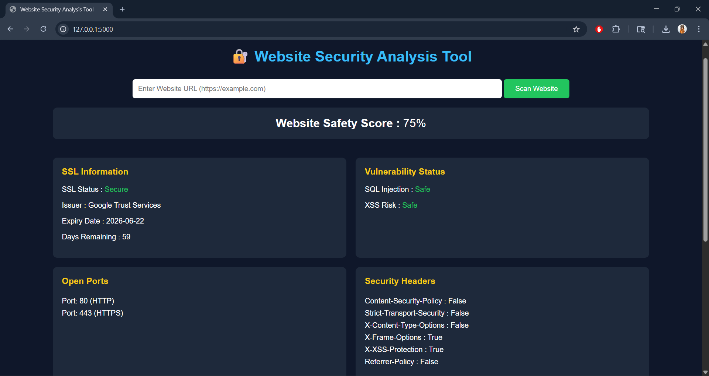
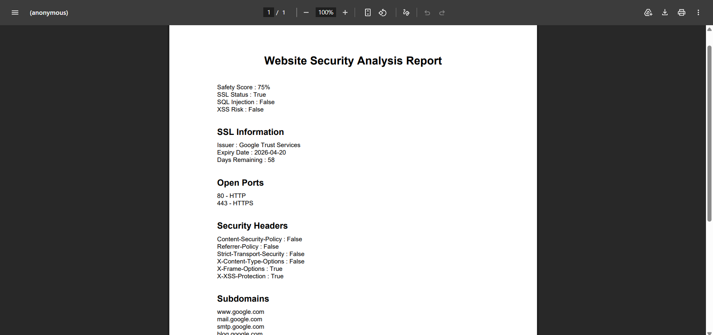

# 🔐 Web Security Analyzer Tool

A Python-based automated Website Security Analysis Tool developed using Flask that evaluates the security posture of websites by performing multiple security checks and vulnerability analysis.

---

# 📌 Project Overview

The **Web Security Analyzer Tool** is designed to analyze websites and identify common security vulnerabilities and misconfigurations. The system performs automated security analysis and generates a website safety score based on detected risks.

The tool integrates multiple cybersecurity modules including:

* SSL Certificate Verification
* Open Port Scanning
* Security Header Analysis
* SQL Injection Detection
* XSS Detection
* Subdomain Enumeration
* WHOIS Lookup
* Website Safety Score Calculation
* PDF Report Generation

This project was developed as a **Minor Project** for the degree of **M.Sc. Cyber Security** at **Amity University Rajasthan**.

---

# 🚀 Features

✅ SSL Certificate Analysis
✅ Open Port Detection
✅ HTTP Security Header Checking
✅ SQL Injection Vulnerability Detection
✅ Cross-Site Scripting (XSS) Detection
✅ Subdomain Enumeration
✅ WHOIS Domain Information Retrieval
✅ Website Safety Score Calculation
✅ PDF Security Report Generation
✅ Flask-Based Dashboard Interface

---

# 🛠 Technologies Used

| Technology         | Purpose                   |
| ------------------ | ------------------------- |
| Python             | Core Programming Language |
| Flask              | Web Framework             |
| HTML/CSS           | Frontend User Interface   |
| Socket Programming | Port Scanning             |
| Requests Library   | HTTP Communication        |
| SSL Module         | SSL Certificate Analysis  |
| dnspython          | Subdomain Enumeration     |
| python-whois       | WHOIS Lookup              |
| ReportLab          | PDF Report Generation     |

---

# 📂 Project Structure

```bash
website_security_tool/
│
├── app.py
├── requirements.txt
│
├── templates/
│   └── index.html
│
├── static/
│   ├── style.css
│   └── script.js
│
├── modules/
│   ├── port_scanner.py
│   ├── ssl_check.py
│   ├── header_check.py
│   ├── vulnerability_scan.py
│   ├── xss_detector.py
│   ├── subdomain_scanner.py
│   ├── whois_lookup.py
│   └── safety_score.py
│
├── screenshots/
│
└── reports/
    └── Security_Report.pdf
```

---

# ⚙️ Installation & Setup

## 1️⃣ Clone Repository

```bash
git clone https://github.com/sumitsoni0521/web-security-analyzer-tool.git
cd web-security-analyzer-tool
```

---

## 2️⃣ Install Dependencies

```bash
pip install -r requirements.txt
```

---

## 3️⃣ Run Flask Application

```bash
python app.py
```

---

## 4️⃣ Open in Browser

```bash
http://127.0.0.1:5000
```

---

# 📊 Working of the System

1. User enters a website URL.
2. Flask backend processes the request.
3. Security modules perform analysis.
4. Data is collected from:

   * HTTP Response Headers
   * SSL Certificate
   * Network Ports
   * DNS & WHOIS Databases
5. Vulnerabilities and risks are identified.
6. Safety score is calculated.
7. Results are displayed on dashboard.
8. PDF security report can be downloaded.

---

# 🔍 Safety Score Logic

The tool uses a rule-based scoring mechanism.

```text
Initial Score = 100%

- Open Ports → Deduction
- Missing Security Headers → Deduction
- SQL Injection Risk → Deduction
- XSS Vulnerability → Deduction

Final Score = Website Safety Percentage
```

---

# 📷 Project Screenshots

### 🖥 Dashboard Interface



### 🔐 SSL & Vulnerability Analysis


### 📄 PDF Report Generation



# 📈 Sample Output

| Parameter       | Status  |
| --------------- | ------- |
| SSL Certificate | Secure  |
| Open Ports      | 80, 443 |
| SQL Injection   | Safe    |
| XSS Detection   | Safe    |
| Missing Headers | 4       |
| Safety Score    | 75%     |

---

# 🎯 Objectives of the Project

* Automate website security analysis
* Detect common web vulnerabilities
* Analyze SSL and security configurations
* Generate safety score for websites
* Provide downloadable security reports
* Improve awareness regarding web security

---

# ⚠️ Disclaimer

This project is developed strictly for educational and authorized security testing purposes only. Unauthorized scanning or testing of websites without permission may violate cybersecurity laws and ethical guidelines.

---

# 🔮 Future Enhancements

* AI-Based Threat Detection
* CVE Database Integration
* Real-Time Monitoring
* Advanced Vulnerability Scanning
* Cloud Deployment
* Graphical Analytics Dashboard

---

# 👨‍💻 Developer

**Sumit**
M.Sc. Cyber Security
Amity University Rajasthan

---

# 📜 License

This project is intended for educational and research purposes.
